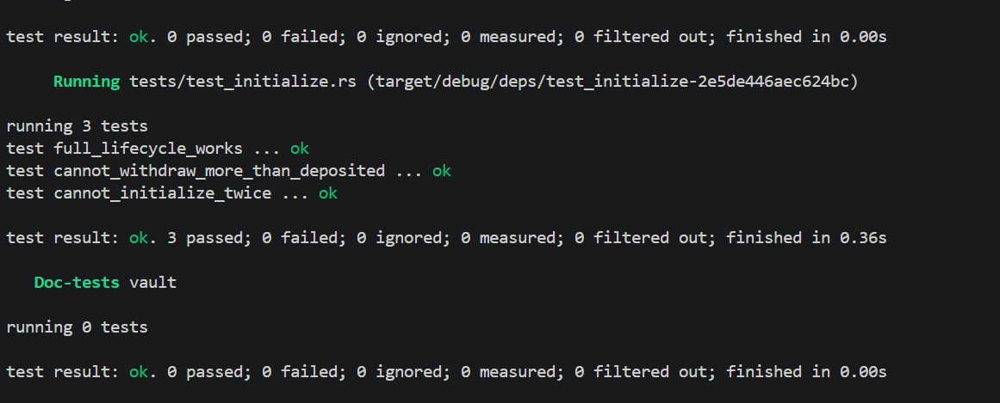

# Vault
 
A simple SOL vault program built with Anchor. Each user gets their own PDA-derived vault to deposit into, withdraw from, and close whenever they want.

## Overview
 
Every user has two PDAs tied to their wallet:
 
| Account       | Type            | Seeds                              | Purpose                                    |
|---------------|-----------------|-------------------------------------|---------------------------------------------|
| `vault_state` | `Account<VaultState>` | `["vault_state", user.key()]` | Stores bump seeds for the user's vault      |
| `vault`       | `SystemAccount` | `["vault", user.key()]`             | Holds the user's deposited SOL              |
 
Because both PDAs are derived from the user's own pubkey, one wallet can only ever touch its own vault — there's no way to pass in someone else's `vault`/`vault_state` and have the seeds still match.

 
## Instructions
 
### `initialize`
Creates `vault_state` for the caller and funds `vault` with enough lamports to cover rent-exemption. Must be called once per user before any deposits — calling it twice fails since `vault_state` uses `init` and the account already exists the second time.
 
### `deposit(amount: u64)`
Transfers `amount` lamports from the user into their `vault` via a CPI to the System Program. No `vault_state` check needed here since `vault` doesn't need to sign anything for an inbound transfer.
 
### `withdraw(amount: u64)`
Transfers `amount` lamports from `vault` back to the user. Since `vault` is a PDA with no private key, the CPI is signed with `vault`'s seeds (`CpiContext::new_with_signer`) using the bump stored in `vault_state`. Withdrawing more than the vault's balance fails at the System Program level.
 
### `close`
Drains all remaining lamports out of `vault` back to the user, then closes `vault_state` (`close = user`), returning its rent to the user as well.

## Project structure
 
```
programs/vault/src/
├── lib.rs                # program entrypoint, instruction dispatch
├── constants.rs          # VAULT_SEED, VAULT_STATE_SEED
├── state.rs              # VaultState account struct
├── error.rs              # custom errors
└── instructions/
    ├── initialize.rs
    ├── deposit.rs
    ├── withdraw.rs
    └── close.rs
programs/vault/tests/
└── test_initialize.rs    # LiteSVM integration tests
```


### Test coverage

`full_lifecycle_works` -> initialize → deposit → withdraw → close all succeed in sequence, and balances update correctly.
`vault_state` no longer exists after `close`.

`cannot_initialize_twice` -> Calling `initialize` a second time for the same user fails, since `vault_state` already exists. 

`cannot_withdraw_more_than_deposited` ->  Attempting to withdraw more lamports than the vault holds fails instead of underflowing/succeeding.
 
#### Proof of testing 

